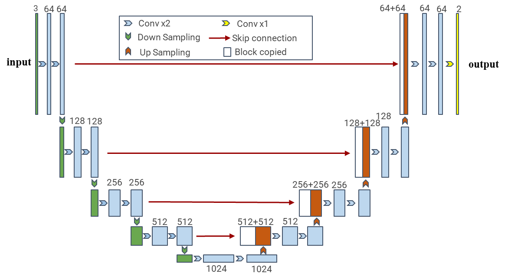

# Project 


Mainly introduce the relevant codes used in the paper, including CT preprocessing, CT2US and U-net training.


##  CT preprocess
- The code has been written in ```Python 3.9.x``` and ```Matlab 2020b```.

- CT preprocessing code directory structure description
```
CT_Process
│ 
├─resample.py       // CT space normalization
│ 
├─Roi_3D.m          //obtain the external 3D rectangle region of the single kidney
│ 
├─wid.py            //adjust the window position and window width
│ 
├─nii2png.py        //obtain 2D slices from 3D volumes
│ 
├─Image_filtering.py //remove 2D slices without kidneys
│ 
├─remove.py          //remove 2D kidney slices containing larger tumors 
│ 
├─noise.m            // fill pixel to remove noise
│
├─main.py
│ 
│  
├─CT_2D
│  ├─Images
│  └─Labels
├─CT_nii
│  ├─master
│  │      master_0.nii.gz
│  │      
│  └─segmentation
│          master_0.nii.gz
│          
├─CT_nii_window
│  ├─master
│  └─segmentation
└─train
    ├─Images
    └─Labels

```

- Requirements
```bash
pip install -r requirements.txt
```
## CT2US
The code is heavily based on [CycleGAN-and-pix2pix](https://github.com/junyanz/pytorch-CycleGAN-and-pix2pix) and [CUT](https://github.com/taesungp/contrastive-unpaired-translation) , and their network models are not changed. FID scores is calculated using [pytorch-fid](https://github.com/mseitzer/pytorch-fid).
## U-net
The network model is just based on the original [Unet](https://arxiv.org/abs/1505.04597) model with some modifications. The modified structure diagram is as follows.



__Conv x2:__ Conv+BNorm+Dropout+LeakyReLu

__Down Sampling :__ Conv+BNorm+LeakyReLu

__Up Sampling :__ Bilinear interpolation+Conv

__Skip connection:__ copy

### Instance-weighting training strategy
 - code directory structure description 
```
Pytorch-Unet-Instance
│
├─config.py          //Parameters need to be configured before training
│
├─data.py
│
├─predict.py         
│
├─net.py
│
├─train.py
│
├─utils.py
│
├─requirements.txt
│
├─dataset
│  ├─SynUS          //simulated kidney US dataset
│  │  ├─Images
│  │  └─Labels
│  └─US             //real kidney US  dataeset
│      ├─Images
│      └─Labels
├─val_data          //validation dataset
│       ├─Images
│       ├─Labels
│       └─pred
├─params
├─test_results
├─train_images
└─train_results
```
- Train a model:
```
python train.py
```
- test the model:
```
python predict.py
```
### Requirements
1. Install ```Python 3``` and [CUDA](https://developer.nvidia.com/cuda-downloads)

2. Install [PyTorch 1.10 or later](https://pytorch.org/get-started/locally/)

3. Install dependencies
```bash
pip install -r requirements.txt
```

